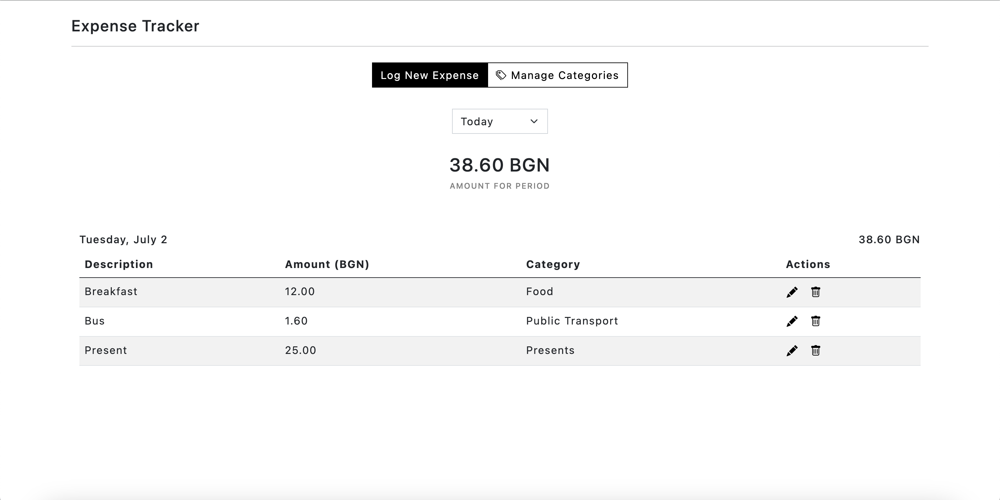
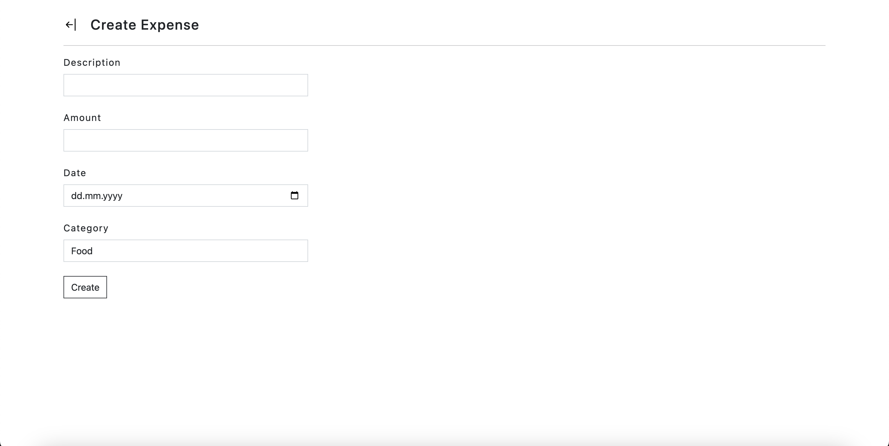
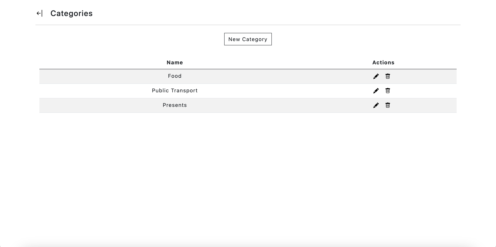
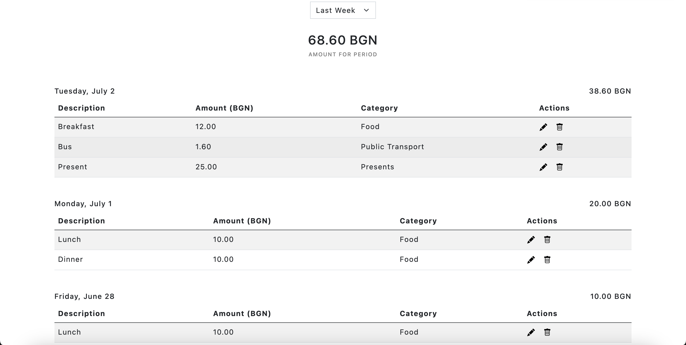

# Expense Tracker

## Introduction

Expense Tracker is an ASP.NET application that helps you log and manage expenses. It has been developed as an university project.

This document will guide you through the installation and configuration of the application.

## Table of Contents
1. [Installation](#installation)
2. [Configuration](#configuration)
3. [Usage](#usage)
4. [Features](#features)
8. [Contact](#contact)

## Installation

### Prerequisites
- [ASP.NET Core SDK](https://dotnet.microsoft.com/download/dotnet-core) (version 8.0.104)
- [SQL Server](https://www.microsoft.com/en-us/sql-server/sql-server-downloads)
- A web browser

### Steps
1. Clone the repository to your local machine:
    ```bash
    git clone https://github.com/nbdobreva/expense-tracker.git
    ```
2. Navigate to the project directory:
    ```bash
    cd expense-tracker
    ```
3. Navigate to the root of your project directory where the `Program.cs` file is located and restore the necessary dependencies:  
    ```bash
    dotnet restore
    ```
4. Build the project and run it
    ```bash 
    dotnet build 
    dotnet run
    ``` 

## Configuration

### Database Configuration
1. Create a new database in SQL Server called "ExpenseTracker".
2. Update the connection string in `appsettings.json` file with your database details:
    ```json
    "ConnectionStrings": {
        "DefaultConnection": "Server=localhost;Database=ExpenseTracker;User Id=sa;Password=<your_password>;Encrypt=True;TrustServerCertificate=True;MultipleActiveResultSets=True;"
    }
    ```

### Running Migrations
Ensure that your database is up to date with the latest schema by running the EF Core migrations:
```bash
dotnet ef database update
```

## Usage

### Starting the Application
To start the Expose Tracker, run the following command:
```bash
dotnet run
```

The application will be accessible at `https://localhost:5004`.

### Expense Entity



#### Creating an Expense
1. Navigate to `/BudgetEntry/Create`.
2. Fill in the expense details and create the expense.



#### Editing an Expense
1. Navigate to `/BudgetEntry/Edit/{id}`.
2. Modify the details and update the expense.

#### Deleting an Expense
1. Navigate to `/BudgetEntry/Delete/{id}`.
2. Review the expense and confirm the deletion.

### Category Entity



#### Creating a Category
1. Navigate to `/Category/Create`.
2. Fill in the details and create the category.

#### Editing a Category
1. Navigate to `/Category/Edit/{id}`.
2. Modify the details and update the category.

#### Deleting a Category
1. Delete the category directly from the `/Category` page

## Features
- **Expense Management**: Create, edit, and delete expenses.
- **Category Management**: Create, edit, and delete categories.
- **Data Visualization**: View your expenses for today/last week/last month and see the total amount of expenses for the selected period. 



## Contact

If you have any questions or feedback, you can reach out to me at:
 [f99529@students.nbu.bg](mailto:f99529@students.nbu.bg)

Thank you for taking interest in Expense Tracker!